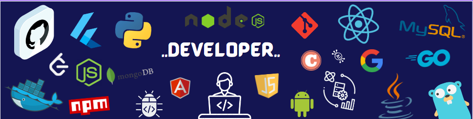

<h1 align="center">Hi 👋, I'm Ayush </h1>
<h3 align="center">A Full Stack Web/App Developer from Earth !</h3>

  

  ## 🌐 About Me :

-> I’m a Full Stack Web and App Developer who makes cool projects.
 
-> Founding Software Engineering Intern @ <a href="https://lunacal.ai/">lunacal.ai</a>
 
-> Creator of <a href="https://www.snipshelf.in">Snipshelf</a> [v2 now live] and <a href="https://peerlist.io/ayush_/project/termai">termAi</a> (thanks to all the users).
 
-> I also won <a href="https://www.sih.gov.in/"> Smart India Hackathon '23 <a/>.
 
-> Previously I worked as a Full Stack Developer at Mojo Web Technology, where I engineered production-ready Software as a Service (SaaS) projects focused on Facebook, and Shopify Tools.
 
-> I had Fun while building <a href = "https://ayush-gupta.vercel.app/" > Ayush Search </a> !
 
-> Currently using Go and Rust [checkout my Text Editor built in Rust]
 
-> Creator of <a href="https://www.github.com/ayushgupta4002/bitboat">BitBoat [Distributed cache system]</a> and <a href="https://www.github.com/ayushgupta4002/echo">Echo [A Terminal based Text Editor] </a>
  📫 You can reach me at **ayush4002gupta@gmail.com**

